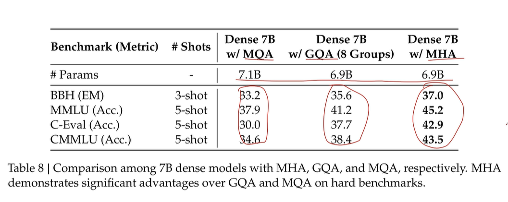

# DeepSeek MLA

## KV Cache

自回归生成任务中，预测下一个token时需要用当前token的Q向量乘以从当前token开始的先前所有token的K向量，计算点积归一化后与所有V向量一起算加权和。也就是说这里前面所有的token的K、V向量都会被用到，需要维护一个cache存储前面所有的K、V向量

pro：减少推理时计算量，加快推理速度

con：随着序列越来越长，KV Cache越来越大，占用大量显存

## 几种注意力机制

- Multi-Head Attention

最经典Transformer，（假设有k个头，QKV向量维度为N）每个token算出的Q、K、V向量拆成k份维度为$\frac{N}{k}$的向量$Q_i,K_i,V_i(i∈[1,k])$，分别并行计算k份$V_i$的加权平均$Z_i(维度为\frac{N}{k})$，最终连接所有$Z_i$得到最终输出（长为N的向量）

- Multi-Query Attention

Multi-Head Attention变体，Q矩阵还是正常拆为k个头，每个头共享同一组K、V参数，因此只需要一个维度为$\frac{N}{k}$的K、V就行，计算还是正常的多头注意力计算。这样减少了K、V矩阵的参数量（输出维度不需要是N维了）

- Grouped-Query Attention

位于上面两种的中间，Q矩阵拆为k个头，其中每若干个头共享一组K、V参数，这样生成K、V向量的数量大于1，小于k

MQA、GQA能减少KV cache的大小，但影响了模型的性能（相同参数量下）：

## MLA - 

