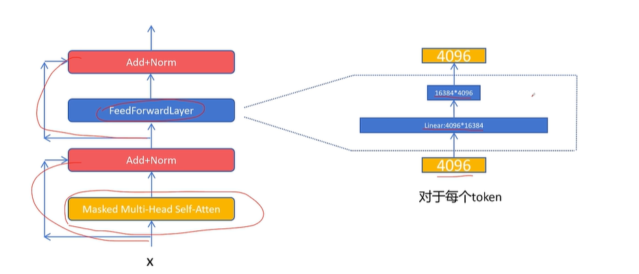

# MoE Mixture of Experts 混合专家模型

选择一个普通的基准大模型：Dense大模型

参数量越大，达到期望损失时训练计算花费越小

但推理时更大参数量的模型花费会更大，且推理是多次后续成本，训练是单次成本


MoE模型：参数量相同时，达到相同训练损失计算花费更小，且推理时所用资源也更少


## 具体结构

稠密大模型：feed forward layer只是一个双层MLP，隐藏层通常大于输入/输出维度




MoE大模型：feed forward layer变成几个并行的、隐藏层维度更小的双层MLP，使用一个路由结构输出选择多个专家的概率分布，选择概率最大的K（超参数）个专家经过，结果加权平均后输出


## 代码实现

```python
import torch
from torch import nn


class ExpertNetwork(nn.Module):
    def __init__(self, hidden_size, intermediate_size):
        super().__init__()
        self.hidden_size = hidden_size
        self.intermediate_size = intermediate_size

        self.linear1 = nn.Linear(hidden_size, intermediate_size)
        self.linear2 = nn.Linear(intermediate_size, hidden_size)

    def forward(self, x):
        x = self.linear1(x)
        x = nn.functional.relu(x)
        output = self.linear2(x)
        return output


class Router(nn.Module):
    def __init__(self, hidden_size, expert_num, top_k):
        super().__init__()
        self.router = nn.Linear(hidden_size, expert_num)
        self.top_k = top_k
        self.hidden_size = hidden_size

    def forward(self, x):
        x = x.view(-1, self.hidden_size)
        x = self.router(x)
        x = nn.functional.softmax(x, dim=1)
        topk_weight, topk_idx = torch.topk(x, k=self.top_k, dim=1, sorted=False)
        # 对topk权重重新归一化
        topk_weight = topk_weight / topk_weight.sum(dim=1, keepdim=True)
        return topk_weight, topk_idx


class MOELayer(nn.Module):
    def __init__(self, hidden_size, intermediate_size, expert_num, top_k):
        super().__init__()
        self.hidden_size = hidden_size
        self.intermediate_size = intermediate_size
        self.expert_num = expert_num
        self.top_k = top_k
        self.experts = nn.ModuleList(
            [ExpertNetwork(self.hidden_size, self.intermediate_size) for _ in range(self.expert_num)]
        )
        self.router = Router(self.hidden_size, self.expert_num, self.top_k)

    def forward(self, x):  # shape of x is (batch_size, seq_len, hidden_size)
        batch_size, seq_len, _ = x.size()
        token_num = batch_size * seq_len
        x_flat = x.view(token_num, self.hidden_size)
        # 通过路由器获得 top-k 专家选择的权重和索引，形状均为 (N, top_k)
        topk_weight, topk_idx = self.router(x)
        # 初始化输出张量
        output = torch.zeros_like(x_flat)
        for token_idx in range(token_num):
            for expert_idx in range(self.top_k):
                expert = self.experts[topk_idx[token_idx, expert_idx]]
                output[token_idx] += topk_weight[token_idx, expert_idx] * expert(x_flat[token_idx])

        output = output.view(batch_size, seq_len, self.hidden_size)
        return output


HIDDEN_SIZE = 4096
INTERMEDIATE_SIZE = 2048
EXPERT_NUM = 8
TOP_K = 2

inputs = torch.randn((2, 11, 4096))
moe_layer = MOELayer(HIDDEN_SIZE, INTERMEDIATE_SIZE, EXPERT_NUM, TOP_K)
outputs = moe_layer(inputs)
print(outputs.size())
```

