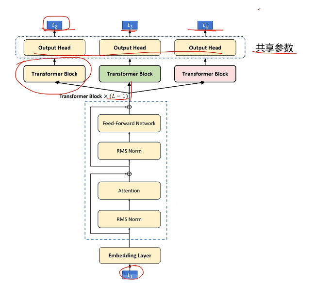

# DeepSeek-V3 MTP

**成本低：**

Llama3 405B：3080万H100GPU小时

DeepSeek-V3：279万H800GPU小时

## DeepSeek-V3的一些结构改进（速览）：

1. MoE的小改动

DeepSeek-V2中MoE的路由值经过softmax后去Top-K，V3认为没必要，因为取Top-K后和也不为1了，直接用sigmoid后取Top-K，然后再在K个之内归一化

- DeepSeek-V2：

$ \mathbf{h}_t' = \mathbf{u}_t + \sum_{i=1}^{N_s} \text{FFN}_i^{(s)} (\mathbf{u}_t) + \sum_{i=1}^{N_r} g_{i,t} \text{FFN}_i^{(r)} (\mathbf{u}_t), $ 

$ g_{i,t} = \begin{cases} s_{i,t}, & s_{i,t} \in \text{Topk}(\{s_{j,t} | 1 \leqslant j \leqslant N_r\}, K_r), \\ 0, & \text{otherwise}, \end{cases} $ 

$ s_{i,t} = \text{Softmax}_i (\mathbf{u}_t^T \mathbf{e}_i), $  

- DeepSeek-V3：

$ \mathbf{h}_t' = \mathbf{u}_t + \sum_{i=1}^{N_s} \text{FFN}_i^{(s)} (\mathbf{u}_t) + \sum_{i=1}^{N_r} g_{i,t} \text{FFN}_i^{(r)} (\mathbf{u}_t), $ 

$ g_{i,t} = \frac{g_{i,t}'}{\sum_{j=1}^{N_r} g_{j,t}'}, $

 $ g_{i,t}' = \begin{cases} s_{i,t}, & s_{i,t} \in \text{Topk}(\{s_{j,t} | 1 \leqslant j \leqslant N_r\}, K_r), \\ 0, & \text{otherwise}, \end{cases} $ 

$s_{i,t} = \text{Sigmoid} (\mathbf{u}_t^T \mathbf{e}_i), $

2. 负载均衡的改动，使用偏置项超参数调节

- **（核心创新点）Auxiliary-Loss-Free Load Balancing**

为每个专家的亲和度得分后又添加一个偏置项$b_i$，根据专家的过载/闲置情况去调整$b_i$。这个偏置项与实际输出后的加权权重是解耦的（决定调哪几个专家计算得分时加上$b_i$，实际输出时乘以的权重不含$b_i$）

- **权重极小**的序列级损失，避免一个sequence里的不同token有极度负载不均衡的情况发生

$ \mathcal{L}_{\text{Bal}} = \alpha \sum_{i=1}^{N_f} f_i P_i $

其中，$f_i$是专家的“使用频率”，$P_i$是专家的“平均重要性”。具体公式：

$T$：序列长度；$K_r$：每个token选择的专家数；$N_r$：总的路由专家数

$ f_i = \frac{N_r}{K_r T} \sum_{t=1}^{T} \mathbf{1}\left(s_{i,t} \in \text{Topk}\left(\{s_{j,t} | 1 \leq j \leq N_r\}, K_r\right)\right) $

形象理解：假设完全负载均衡，应当$N_r·\{选择该专家的次数\}=K_rT$，而式子右侧$\sum_{t=1}^{T} \mathbf{1}\left(s_{i,t} \in \text{Topk}\left(\{s_{j,t} | 1 \leq j \leq N_r\}, K_r\right)\right)$就是选择该专家的次数。因此，当完全负载均衡时，应当$f_i=1$，负载高于均衡则大于1，低于均衡则小于1

$ P_i = \frac{1}{T} \sum_{t=1}^{T} s_{i,t}' $，其中$ s_{i,t}' = \frac{s_{i,t}}{\sum_{j=1}^{N_r} s_{j,t}} $，就是把每个专家的得分归一化了（变成和为1）。简单粗暴，就是每个token选择第i个专家概率的平均。

## Multi-Token Prediction(MTP)

本质上是将最后一个Attention层换成多个，三个Output Head共享参数。预测$t_3$和$t_4$时的loss权重会比$t_2$小一些，都用交叉熵损失

类比人：人在说一句话时，大脑不是一个字一个字生成序列，而是一下子可以生成一个语义片段

**优势：**

（1 token变成多 token）MTP 目标可以增加训练信号，提高数据利用率

MTP 可能使模型能够提前规划其表示，从而更好地预测未来token

加速预测：

TODO
