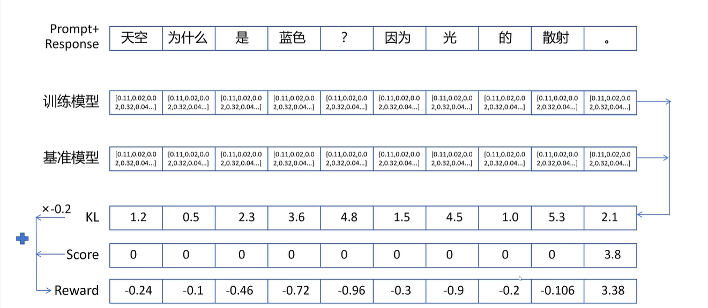

# 用PPO训练LLM

Pretrain -> SFT -> Reward -> PPO

## 如何训练Reward Model？

微调第一步：训练一个Reward Model，为模型输出打分，提供奖励信号

- 用户偏好数据

例如：

question: 什么是数据库？

chosen: 数据库是一个有组织的数据集合，允许高效的数据存储、检索和管理

rejected: 数据库用于存储数据

- Reward Model

接受问答对序列，输出得分值，可以用Bert/大模型

能力不能比当前模型弱很多，一般采用和当前模型差不多或能力更高的模型

为什么差不多能力的大模型可以提供改进的监督信号？评价回答的好坏比生成一个好的回答容易很多；输出能力提升->回答能力也会提升

大模型能力极限由预训练决定，强化学习只是尽可能达到极限

如何用LLM做Reward Model？最后输出层的权重本来是$num\_hidden*num\_vocabulary$（这里称LM Head，用来预测next token的），现在给换成$num\_hidden*1$（这里称Score Head），输出单一的值。且只对最后一个输入token的输出做这个score head，因为只有最后一个token可以看到整个序列

训练Reward Model的Loss是什么？

$Loss = -log\ sigmoid(score_{chosen}-score_{rejected})=-\log(\frac{1}{1+e^{-x}}),x=score_{chosen}-score_{rejected}$

## 如何训练PPO模型？

- 准备query数据

各种问题，如“量子计算是什么”...

- 准备四个模型

基准模型（SFT后的模型）-> LM Head，输出是字典维度

训练模型，结构与基准模型一致，训练过程中训练模型的输出与基准模型不能相差太大

奖励模型，输出对回答序列的评分 -> Score Head

状态价值模型，对每个状态（即，历史token——包括prompt和已生成的token——的序列）进行打分

四个大模型参数太大？**Lora**：（其中在训练的模型和状态价值模型公用一个基座，采用不同的输出头）

如何定义每个action（即生成单个token）的reward？这里使用直接的reward（奖励模型输出的值，只有最后一个有）和基准/训练模型在输出每个token时概率分布的KL散度来计算。$reward = KL*(-0.2)+score$

状态价值的Label是什么？

蒙特卡洛法：$V_{label}(s_t)=r_t+\gamma r_{t+1}+\gamma^2 r_{t+2}+\dots+\gamma^{T-t}r^T$

时序差分法：$V_{label}(s_t)=r_t+\gamma V(s_{t+1})$

广义优势法：$V_{label}(s_t)=A_t^{GAE}+V(s_t)$

