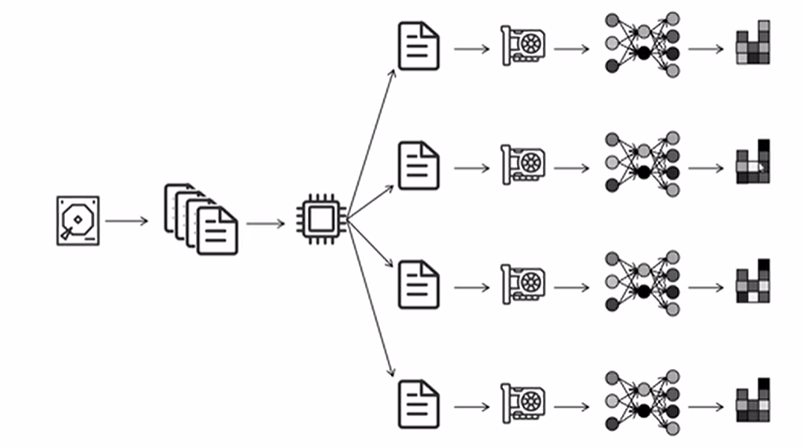

# 分布式训练

source: [动画理解Pytorch 大模型分布式训练技术 DP，DDP，DeepSpeed ZeRO技术_哔哩哔哩_bilibili](https://www.bilibili.com/video/BV1mm42137X8/?spm_id_from=333.337.search-card.all.click&vd_source=73e54c2ac162fbf942d5792a881e18b2)

## 单机单卡训练流程

硬盘读取数据 -> cpu处理数据 -> 将数据组成一个batch，传入GPU -> 进行网络前向传播，算出Loss，进行后向传播，计算梯度，更新网络参数

## Pytorch中的最早数据并行框架 Data Parallel - DP

硬盘读取数据 -> 一个CPU进程将数据分成多份，每个GPU一份，每个GPU独自进行前向传播、反向传播，计算各自的梯度；所有GPU将自己算的梯度传递到GPU 0上，进行平均，GPU 0用全局平均的梯度更新自己的网络，然后将更新后参数广播到其他GPU上

核心问题：如何减少多GPU间的通信量，以提高效率。单机多卡训练时，可能有一半多的时间都被GPU之间的通信占用

**DP 的通信量分析：**

假设参数量为*ψ*，节点数为*N*。

则对于 GPU:0
传入梯度为: (*N*−1)*ψ*
传出参数为: (*N*−1)*ψ*

对于其他 GPU:
传出梯度为*ψ*
传入参数为*ψ*

**问题1：**单进程，多线程，Python GIL只能利用一个CPU核

**问题2：**GPU1负责收集梯度，更新参数，同步参数。通信、计算压力大

## Distributed Data Parallel - DDP

