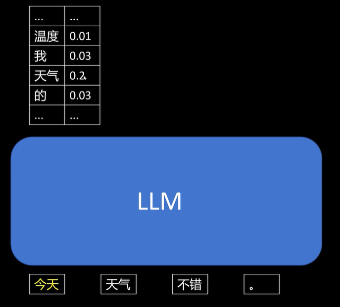

# LLM预训练 Pretrain

## 基本方法

预训练两种含义：

1. 从0开始，随机初始化所有参数
2. 开源已经预训练好的基础上，针对特定行业加强训练，提升通用模型的领域知识和能力

预训练语料：“今天天气不错。”

假设分词分为：`今天`，`天气`，`不错`，`。`

最开始输入“今天”，预测下一个token，需要让“天气”的概率尽可能大，其他token的概率尽可能小

同理，输入“今天 天气”，要让预测下一个token为“不错”的概率尽可能大，其他的概率尽可能小

后面的以此类推

对于最后的输入“今天天气不错。”，丢弃预测的下一个token，不对其进行loss计算

对输出结果当作分类问题来算，使用Cross Entropy Loss，预测结果是每个token的概率分布，标签就是句子的每一个token
