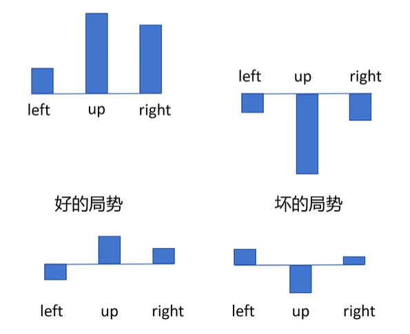
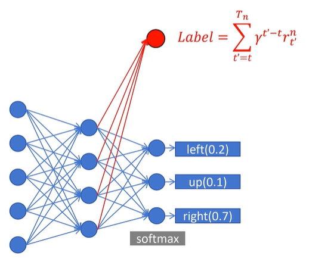

# 基于策略的RL-Policy Gradient, PPO

## RL基础

**Action Space:** 可选择的动作，比如 {left, up, right}

**Policy:** 策略函数，输入 State，输出 Action 的概率分布。一般用 π 表示。

π(left|sₜ) = 0.1
π(up|sₜ) = 0.2
π(right|sₜ) = 0.7

**Trajectory:** 轨迹，用 τ 表示，一连串状态和动作的序列。Episode,Rollout。 {s₀, a₀, s₁, a₁, …}

sₜ₊₁ = f (sₜ, aₜ) 确定
sₜ₊₁ = P (・|sₜ, aₜ) 随机（比如游戏里开宝箱，给定“开宝箱”动作，由于宝箱内物品随机，下一个状态也是随机的）

**Return:** 回报，从当前时间点到游戏结束的 Reward 的累积和。

强化学习的目标：训练一个Policy神经网络$\pi$，在所有状态S下，给出相应的Action，得到Return的期望最大

强化学习的目标：训练一个Policy神经网络$\pi$，在所有的Trajectory中，得到Return的期望最大

## Policy Gradient

### b站@RethinkFun的推导

要优化的式子：$E_{τ∼P_θ(τ)}[R(τ)]=∑_τR(τ)P_θ(τ)$，其中$τ$是某条轨迹，这个式子表示策略下所有被采样轨迹的期望return

使用梯度上升法，两边同时取梯度得：（要优化的参数是$\theta$）

$\nabla E_{τ∼P_θ(τ)}[R(τ)]=\nabla \sum_τR(τ)P_θ(τ)=\nabla\sum_\tau R(\tau)\nabla P_\theta(\tau)=\sum_\tau R(\tau)\nabla P_\theta(\tau)\frac{P(\tau)}{P(\tau)}=\sum_\tau R(\tau) P_\theta(\tau)\frac{\nabla P(\tau)}{P(\tau)}$

这里$\sum_\tau R(\tau) P_\theta(\tau)$可以通过采样n份求平均来近似预估，因此：

$原式\approx \frac{1}{N}\sum_{i=1}^N R_\theta(\tau_i)·\frac{\nabla P_\theta(\tau_i)}{P_\theta(\tau_i)}=\frac{1}{N}\sum_{i=1}^N R(\tau_i)·\nabla log(P_\theta(\tau_i))$

现在考虑怎么表示$P_\theta(\tau_i)$。我们知道一条Trajectory是由初始状态与一系列action导致的状态转移导致的，因此只需要对各个状态取走这条路径的action概率连乘即可：

$P_\theta(\tau_i)=\Pi_{t=1}^{T_i}P_\theta(a_i^t|s_i^t)$，其中$T_i$表示第i条路径的长度，$P_\theta(a_i^t|s_i^t)$表示第i条路径上，第t个状态取转化到第(t+1)个状态的动作的概率。

因此：

$上式=\frac{1}{N}\sum_{i=1}^N R(\tau_i)·\nabla log(\Pi_{t=1}^{T_i}P_\theta(a_i^t|s_i^t))=\frac{1}{N}\sum_{i=1}^N R(\tau_i)· \sum_{t=1}^{T_i}\nabla log(P_\theta(a_i^t|s_i^t))=\frac{1}{N}\sum_{i=1}^{N}\sum_{t=1}^{T_i}R(\tau_i)·\nabla log(P_\theta(a_i^t|s_i^t))$

用这个梯度来做梯度上升，乘以学习率更新神经网络中的参数：Policy Gradient

因此我们（在当前epoch中）要优化的式子可以写作

第一部分：Trajectory得到的return，第二部分：某一步骤的概率的连加。这个式子表示：当$R(\tau_i)>0$，倾向于使$\theta$向路径上的所有动作选择概率增大的方向优化，反之则向路径上所有动作选择概率变小的方向优化

等价于定义$Loss=-\frac{1}{N}\sum_{i=1}^{N}\sum_{t=1}^{T_i}R(\tau_i)·log(P_\theta(a_i^t|s_i^t))$，然后梯度下降更新网络参数

需要运行模型采集数据，根据采集到的数据训练模型，再重复采集数据，以此循环。是**On-Policy**算法，训练慢

### Policy Gradient改进

上面的式子有两个问题：

1. Return > 0，trajectory中所有Action的概率全增大，反之全减小，这个需要优化。每个Action应该只看它之后的Return，因为这个Action没法改变之前已经发生的Return变化，只能影响后面的Reward
2. 一个Action可能只影响接下来的几步，影响逐步衰减，特别后面的Reward主要还是由后面的Action影响

改进：

$R(\tau_i)→\sum_{t'=t}^{T_i}\gamma^{t'-t}r_{i}^{t'}=R_i^t$（①对当前步到Trajectory结束进行reward求和，②引入衰减因子$\gamma$）

原式可优化为$\frac{1}{N}\sum_{i=1}^{N}\sum_{t=1}^{T_i}R_i^t\nabla logP_\theta(a_i^t|s_i^t)$

## 继续改进

上面的改进后，还是有问题：

当一条路径整体处于“好的局势”（return为正）时，所有动作的概率提升；整体处于“坏的局势”（return为负）时，所有动作的概率下降。会使得收敛速度变慢，因为有些差的动作反而概率变大了，有些好的动作反而概率变小了。方差很大，训练不稳定

改进：增加一个baseline，对所有reward都减去baseline，就能看出来哪个动作相对更好，哪个动作相对更差

$原式=\frac{1}{N}\sum_{i=1}^N\sum_{t=1}^{T_i}(R_i^t-B(s_i^t))\nabla logP_\theta(a_i^t|s_i^t)$

- 先交代几个概念：

**Action-Value Function**

$Q_\theta(s,a)$: 在state s下，做出Action a，期望的回报。动作价值函数

**State-Value Function**

$V_\theta(s)$: 在state s下，期望的回报。状态价值函数

**Advantage Function**

$A_\theta(s,a)=Q(s,a)-V_\theta(s)$: 在state s下，做出Action a，比其他动作能带来多少优势

$\frac{1}{N}\sum_{i=1}^N\sum_{t=1}^{T_n}A_\theta(s_i^t,a_i^t)\nabla log P_\theta(a_i^t|s_i^t)$

- 如何计算优势函数？

$Q(s_t,a)=r_t+\gamma*V_\theta(s_{t+1})$

$A_\theta(s_t,a)=r_t+\gamma*V_\theta(s_{t+1}-V_\theta(s_t))$

-> 只需要训练一个代表状态价值的函数

$V_\theta(s_{t+1})\approx r_{t+1}+\gamma*V_\theta(s_{t+2})$

向未来看不同采样步骤数的优势函数：

$A_θ^1(s_t,a_t)=r_t+γV_θ(s_{t+1})−V_θ(s_t)$

$A_θ^2(s_t,a_t)=r_t+γr_t+1+γ^2V_θ(s_{t+2})−Vθ(s_t)$

$A_θ^T(s_t,a_t)=(r_t+γr_{t+1}+…)−V_θ(s_t)$

从上到下：偏差减少，方差增大。（看的越远，受到未来事件的随机性影响越大，$A_\theta$方差越大）

定义$\delta$，表示在某一步执行特定动作带来的优势

$\delta_t^V=r_t+\gamma*V_\theta(s_{t+1})-V_\theta(s_t)$

$\delta_{t+1}^V=r_{t+1}+\gamma*V_\theta(s_{t+2})-V_\theta(s_{t+1})$

这样就可以简洁地表示优势函数：

$A_\theta^1(s_t,a)=\delta^V_t$

$A_\theta^2(s_t,a)=\delta^V_t+\gamma\delta_{t+1}^V$

$A_\theta^3(s_t,a)=\delta^V_t+\gamma\delta_{t+1}^V+\gamma^2\delta^V_{t+2}$

在进行优势函数计算时，应该采样几步呢？——“我全都要”

**Generalized Advantage Estimation (GAE)** - 后面所有采样步骤的优势函数都考虑了，但越靠后的权重越低

$A_\theta^{GAE}(s_t,a)=(1-\lambda)(A_\theta^1+\lambda A_\theta^2+\lambda^2A_\theta^3+\dots)=(1-\lambda)(\delta_t^V+\lambda(\delta_t^V+\gamma\delta_{t+1}^V)+\lambda^2(\delta_t^V+\gamma\delta_{t+1}^V+\gamma^2\delta_{t+2}^V)+\lambda^3(\delta_t^V+\gamma\delta_{t+1}^V+\gamma^2\delta_{t+2}^V+\gamma^2\delta_{t+3})+...)$

根据等比数列可推知，

$上式=(1-\lambda)(\delta_t^V\frac{1}{1-\lambda}+\gamma\delta_{t+1}^V\frac{\lambda}{1-\lambda}+\dots)=\sum_{b=0}^∞(\gamma\lambda)^b\delta_{t+b}^V$

- 最终，我们得到了三个最关键的式子：

$\delta_t^V=r_t+\gamma*V_\theta(s_{t+1})-V_\theta(s_t)$**（某一状态下，某一步执行特定动作带来的优势）**

$A_\theta^{GAE}(s_t,a)=\sum_{b=0}^∞(\gamma\lambda)^b\delta_{t+b}^V$**（某一状态采取某步骤的总体优势函数）**

$\frac{1}{N}\sum_{i=1}^N\sum_{t=1}^{T_n}A_\theta(s_i^t,a_i^t)\nabla log P_\theta(a_i^t|s_i^t)$**（策略网络参数的梯度）**

为了最终结果的优化，首先要训练状态价值函数$V_\theta(s_t)$，用一个神经网络拟合，一般可以**和策略函数的网络共享参数**，只是最后一层不同，输出层为单一的值

如何训练价值函数的网络？使用带衰减的reward和作为$V_\theta(s_t)$的label

## 步入PPO

On Policy v.s. Off Policy

例子：小明找老师评价，老师批评小明上课玩手机，小明根据批评调整自己的策略（降低上课玩手机的概率），属于On Policy

其他同学根据老师对小明的批评，调整自己的策略，属于Off Policy。如果上课玩手机比小明多，降低的概率更多；反之降低的概率更小。

- 重要性采样

$E(f(x))_{x\sim p(x)}=\sum_xf(x)*p(x)=\sum_xf(x)*p(x)\frac{q(x)}{p(x)}=\sum_xf(x)\frac{p(x)}{q(x)}*q(x)=E(f(x)\frac{p(x)}{q(x)})_{x\sim q(x)}\approx \frac{1}{N}\sum_{n=1}^Nf(x)\frac{p(x)}{q(x)}_{x\sim q(x)}$

即：把x换到另一个概率分布里，再乘以原始概率与新分布中的概率的比值，就能达到在对应值“伸缩”的结果
