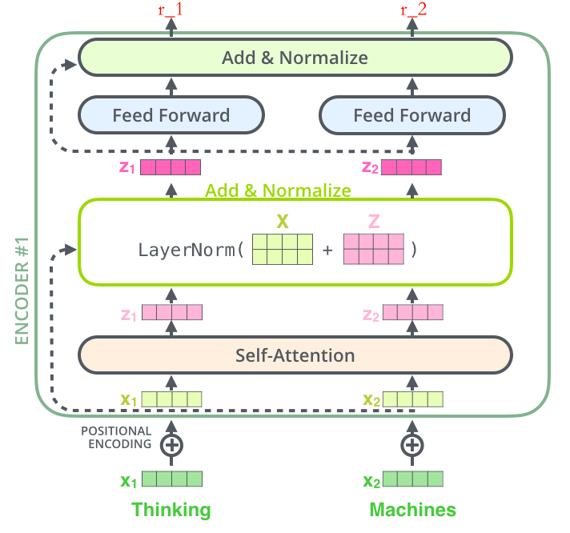

# 从零Tramsformer理论

## 预训练

### 用处？

很多项目没有大数据支持？猫狗分类任务，只有100张猫和狗的图片

已知100000张鹅和鸭的图片->有人做过这样的模型->固定浅层参数，随机初始化深层参数，用少量数据训练深层参数

**越浅的层学到的特征越通用（横竖撇捺），越深的层学到的特征和具体任务的关联性越强（人脸-人脸轮廓、汽车-汽车轮廓）**

浅层：靠近输入；深层：靠近输出

冻结：浅层参数不变

微调：浅层参数会跟着任务B训练而改变

### 是什么?

通过一个已经训练好的模型A，去完成一个小数据量的任务B

任务A和任务B极其相似

### 怎么用？

`fairseq`、`transformer`库

### 总结

对于一个具有少量数据的任务 A，首先通过一个现有的大量数据搭建一个 CNN 模型 A，由于 CNN的浅层学到的特征通用性特别强，因此在搭建一个 CNN 模型 B，其中模型 B 的浅层参数使用模型 A 的浅层参数，模型 B 的高层参数随机初始化，然后通过冻结或微调的方式利用任务 A 的数据训练模型 B，模型 B 就是对应任务 A 的模型

## 4 统计语言模型

### 语言模型

语言（人说的话）+模型（表示某个东西，完成某个任务）

### 统计语言模型

基本思想：**计算条件概率**

$P(w_1,w_2,⋯,w_n)=P(w_1)P(w_2|w_1)P(w_3|w_1,w_2)⋯p(w_n|w_1,w_2,⋯,w_{n−1})=∏_iP(w_i|w_1,w_2,⋯,w_{i−1})$

两个任务：

1. 比较。假设给定两句话 **“判断这个词的磁性”** 和 **“判断这个词的词性”**，语言模型会认为后者更自然。转化成数学语言也就是：

`P(判断，这个，词，的，词性)>P(判断，这个，词，的，磁性)`

2. 预测。假设给定一句话做填空 **“判断这个词的\_\_\__\____”**，则问题就变成了给定前面的词，找出后面的一个词是什么，转化成数学语言就是：

`P(词性|判断，这个，词，的)>P(磁性|判断，这个，词，的)`

（遍历词典库V中每一个词计算）

### n元统计语言模型

对一句话的前面很多个词，只取最接近最后面的n个

二元统计语言模型：

$ P(词性|的) $

### 平滑策略

对于绝大多数具有现实意义的文本，会出现数据稀疏的情况，例如**训练时未出现，测试时出现了的未登录单词**

$ P(w_i|w_{i−1})= \frac{count(w_{i−1},w_i)+1}{count(w_{i−1})+|V|} $

## 5 神经网络语言模型 NNLM->为了预测下一个词

用神经网络的方法解决语言问题

### 独热编码

假设词典V共有8个单词，给出一个8*8的矩阵

"time": [1,0,0,0,0,0,0,0]

"fruit": [0,1,0,0,0,0,0,0]

关联性：余弦相似度来计算。在这里是两个向量点乘，显然只有两个单词相同时结果才不为0，因此并没有解决词之间关联性的问题。

缺点：维度灾难，表示不了相似性

### 词向量（神经网络语言模型的副产品）

假设词的独热编码为$W_i$(1×V)，训练模型时会计算$W_i·Q$；$Q$为可学习的参数，大小为V×m。

那么$C_i = W_i · Q$ 为词向量

这样$C_i$的大小就可以通过控制$Q$的维度来控制，比独热编码更方便存储和计算；同时一定程度上解决了词之间相似度的问题。

### 总结

神经网络语言模型：通过神经网络解决两个人说的话的问题

有一个副产品-Q矩阵，得到词向量，可以控制词向量大小，方便计算，解决相似度问题

## 6 Word2Vec模型->为了得到词向量

目的：得到词向量，而不是仅仅将词向量作为副产物

不考虑细节，word2vec和NNLM结构上一样

### CBOW

给出一个词的上下文，得到这个词

"我是最 _ 的Nick"

### Skip-gram

给出一个词，得到这个词的上下文

"帅"

"我是最_的Nick"

### NNLM和Word2Vec的区别

NNLM -> 重点是预测下一个词

Word2Vec -> 重点是得到Q矩阵

### Word2Vec的缺点

Q矩阵的设计

一词多义没法解决："apple"经过Q矩阵计算的词向量只可能是一个值

## 7 预训练语言模型的下游任务改造简介

先用独热编码，再通过Word2Vec预训练好的Q矩阵直接得到词向量，然后进行接下来的任务

## 补充：RNN

RNN实际上就是一个带有**记忆**的时间序列的预测模型，每个神经元包含了当前信息和之前的信息

上图左边部分称作 RNN 的一个 timestep，在这个 timestep 中可以看到，在 t 时刻，输入变量 xt，通过 RNN 的一个基础模块 A，输出变量 ht，而 t 时刻的信息，将会传递到下一个时刻 t+1

每次基于当前的观测$ X_i $以及之前的隐藏层信息$h_{i-1}$获得输出$o_i$（即图上的$h_i$）和传递给下一个神经元的隐藏层信息$h_i$（图上未画）

### RNN的问题

梯度消失/爆炸，无法长期保持比较早期的记忆

还是没解决一词多义问题

## 补充：LSTM

## 8 ELMo模型（双向LSTM模型解决词向量多义问题）

## 9 Attention 注意力机制

大数据：什么数据都有，有重要的也有不重要的

传统神经网络如CNN、LSTM无法确定哪个重要

注意力机制解决哪些数据比较重要的问题

我们会把我们的焦点聚焦在比较重要的事物上

### 怎么做注意力

Q: Query，可以视为当前任务或上下文中的“焦点”或“问题”

K: Key，是与输入数据中的每个元素相关联的表示，它们与Q进行比较，以确定每个输入元素与当前查询的相关性。

V: Value, 是输入数据中每个元素的表示，包含了实际的信息内容。在注意力机制中，V根据与Q的相关性（通过K计算出的权重）进行加权求和，从而生成最终的注意力输出。

首先Q和K求点积，得到Query和K对应的分量$k_i$的关联度。值大的关联度大，再经过类softmax函数将这些值转化为概率分布。

再将这个获得的概率分布作用于V的所有分量，得到最终的注意力值

### `K`和`V`矩阵的关系：（便于理解，来自chatglm）

- **`K`矩阵用于计算注意力得分**：`K`矩阵中的每个键向量与查询矩阵`Q`中的每个查询向量进行比较，以确定输入序列中不同元素之间的相关性或重要性。
- **`V`矩阵提供输出的“值”**：一旦计算出了注意力权重，这些权重就用来对`V`矩阵中的值进行加权。这意味着，对于每个查询位置，`V`矩阵中的值将根据与该查询最相关的键来加权，从而形成该位置的输出表示。
- **关系**：`K`和`V`矩阵是成对出现的。在计算注意力时，`K`决定了对`V`中每个值的权重分配。如果某个键`K_i`与某个查询`Q_j`非常相关，则对应的值`V_i`在输出表示中将具有更高的权重。

## 10 自注意力机制

1. 首先对输入并做过embedding的每个词向量X，分别乘以$W_Q$、$W_K$、$W_V$矩阵得到Q、K、V向量，代表这个单词的Query、Key、Value

2. 对每个词$i$，遍历所有词$j$，计算$Q_i·K_j$，得到词$i$和词$j$的“相似度”；再做一个scale函数，防止`softmax`过程中出现极端情况
3. 对上述的词$i$和每一个词$j$相乘做的向量做`softmax`，得到$i$和每一个$j$相似度的概率形式
4. 将上述概率与每一个单词的$V$矩阵相乘，并求和，得到词$i$的最终注意力值

## 10+ 自注意力机制和注意力机制的区别

自注意力机制Q、K、V同源，均来自输入的词向量X

注意力机制K、V同源，Q是额外的查询输入

## 11 Self-Attention相较于RNN和LSTM的优缺点

RNN：对比较靠前的数据记忆力很弱，无法做长序列，当一句话达到50个字，效果很差了

LSTM通过各种门，选择性的可以记忆之前的信息（200个词）

### Self-Attention和RNNs的区别

RNNs 长序列依赖问题

无法做并行

Self-Attention可以做并行（每个单词$i$的输出注意力值都可以同步运算）

但Self-Attention随输入序列长度计算耗时增大更快（复杂度O(n^2)）

而RNNs这种序列模型只需要从头到尾计算一次，O(n)

## 12 Masked Self-Attention 掩码自注意力机制

在自注意力机制上加了改进

为什么要做这个改进：生成模型，生成单词，一个一个生成的

当我们做生成任务的时候，我们也想对生成的这个单词做注意力计算，但是，生成的句子是一个单词一个单词生成的

训练时，当要计算的Query枚举到$i$时，不能看到$i$之后的key

应用掩码后得到的`softmax`后得出的概率可能如下：

## 13 Multi-Head Self-Attention（多头注意力机制）

过程：输入单词的embedding向量$X$切割成$n$份，经过$n$组$W_Q、W_K、W_V$矩阵得到$n$组$Q、K、V$向量，每组分别做一个attention计算，将得到的$n$组向量$Z_i$合并成向量$Z$，最终再乘以权重向量$W^O$得到最终该单词的注意力值

## 14 Positional Encoding 位置编码

Self-Attention缺点：计算注意力值的时候只考虑上文有哪些词，而没有考虑这些词的顺序。因此我们要加入这些词的顺序信息。

具体做法：

$PE_{(pos,i)}=sin(pos/10000^{2i/d})(i是偶数)$

$PE_{(pos,i)} = cos(pos/10000^{2(i-1)/d})(i是奇数)$

这里$pos$是当前词在长句子中的位置下标，$i$是该词的词向量的元素下标，$d$是该词的词向量的长度

### 为什么这么做有用？

由三角函数展开式

$sin(\alpha+\beta) = sin\alpha cos\beta+cos\alpha sin\beta$

$cos(\alpha+\beta)=cos\alpha cos\beta-sin\alpha sin\beta$

我们可以得到：

$PE(pos+k,2i) = PE(pos,2i)·PE(k,2i+1) + PE(pos,2i+1)·PE(k,2i)$

$PE(pos+k,2i+1)=PE(pos,2i+1)·PE(k,2i+1)-PE(pos,2i)·PE(k,2i)$

这样，对pos+k位置的单词的i位置的编码，是由位置pos和位置k向量的i和i+1位置的线性组合而来

## 15 Transformer 框架概述

NLP中预训练的目的：生成词向量

Transformer就是Attention的堆叠

seq2seq

序列（编码器）到序列（解码器）

序列：有前后关系的一串东西（一句话，一个视频）

**分成两部分：**

编码器：把输出变成一个词向量（Self-Attention）

解码器：得到编码器输出的词向量后，生成翻译的结果

上图中Nx的含义为编码器内有N个小的编码器（默认N=6）

通过6个编码器，对词向量一步又一布的强化（增强）

Feed Forward：前馈神经网络FFN：一种最基础的神经网络架构，其中信息只在网络中单向传播，从输入层经过一个或多个隐藏层，最后到达输出层，大体上可以理解为MLP或其微调变体。

## 16 编码器 Encoder —— 更优秀的词向量

Encoder总览：大体上由一个Self-Attention和一个前馈网络层组成；核心目的——将源单词转化为它的词向量（这里主要是K、V）供Decoder使用

Encoder细节图：

详细步骤：（以词thinking为例）

1. thinking -简易的embedding，如`word2vec`或`one-hot`编码-> 绿色的$x_1$

2. $x_1$->加入位置编码->得到黄色的$x_1$

3. 通过自注意力机制获取上下文信息，得到$z_1$

4. 加一层残差网络，防止梯度消失/爆炸
5. $z_1$-前馈神经网络->得到网络输出（词向量）
6. 循环上面的过程，得到最终输出

Encoder提供序列中每个词的K、V向量给Decoder使用

## 17 解码器 Decoder

Decoder总览：最底部输入已经生成的目标词，中间输入Encoder生成的词向量，输出最终的结果

**Decoder细节流程：**

1. 已经生成好的outputs经过普通embedding、positional embedding后做attention、残差网络得到Q向量，作为对Encoder生成的K、V矩阵的查询（注意训练阶段所有outputs已知，但模型不应当知道还未生成的outputs，故这里要用到Masked Multi-head Attention

2. 该Q向量与K、V矩阵做Encoder-Decoder Attention，输出结果经过残差网络和前馈网络，再通过Linear层将维度变为词表相同的维度，最终softmax换成概率生成下一个output，即目标序列的一个词

3. 步骤2中生成的那个词配合之前生成的词再输入Masked Multi-Head Attention层，做下一个词的生成

## 18 Transformer全流程

以机器翻译任务为例，将法语翻译成英语

**第一个词的生成：**

Encoder将所有词转化为词向量，提供K、V矩阵供给Decoder使用。由于是第一个词，Decoder无法接受之前的outputs（可能是另一个类似\<eof>符号的输入作为Q，不太清楚），利用此K、V矩阵生成第一个词

**后续单词的生成：**

将前面生成的单词作为outputs输入Masked Multi-Head Attention层，得到下一个输出，循环该过程

## 19 Transformer解码器的两个为什么

**为什么做掩码？**

训练时和测试时的区别

训练时整个目标序列已知，但实际生成第i+1个词时应当只知道前i个词的信息，故需要把后续的单词进行masked

**为什么用Encoder-Decoder Attention？**

Q来源Decoder，K==V来源于Encoder

当我们生成这个词的时候，通过已经生成的词和源语句做注意力机制，通过部分去全部的里面挑重点

解决了以前的`seq2seq`框架的问题

lstm做编码器（得到词向量C），再用lstm做解码器生成

用这种方法去生成词，每一次生成词，都是通过C的全部信息去生成

很多信息对于当前生成词而言都是没有意义的
