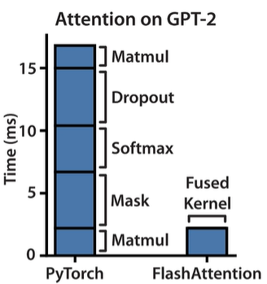
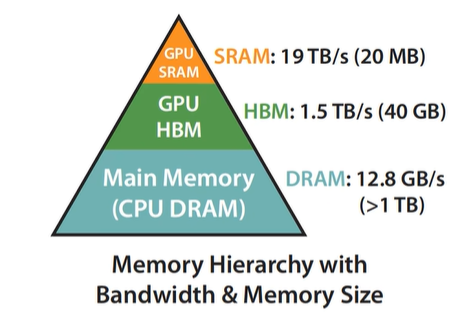

# Flash Attention

论文标题：【Fast and Memory-Efficient Exact Attention with IO-Awareness】

改进IO效率，速度快，内存使用高效，不损失精度

基础概念：

- HBM：High Bandwidth Memory，高宽带内存。是主流GPU使用的主显存，容量大（几十G），速度较慢
- SRAM：Static Random-Access Memory，静态随机存取存储器。是GPU计算核心旁边的高速缓存，容量小，速度很快

## 原始Attention实现：

矩阵 $Q, K, V \in \mathbb{R}^{N \times d}$ 存储在HBM。 

1. 从HBM加载$Q, K$到SRAM 
2. 计算出$S = QK^T$ 
3. 将$S$写到HBM
4. 将$S$加载到SRAM
5. 计算$P = \text{softmax}(S)$ 
6. 将$P$写出到HBM 
7. 从HBM加载$P$和$V$到SRAM 
8. 计算$O = PV$
9. 把$O$写出到HBM
10. 返回$O$

注意到，S和P矩阵都是$O(n^2)$的

两种瓶颈类型的操作：

Compute-Bound（计算时间占大头，存储间的IO通信占小头）：大的矩阵乘法，多Channel的卷积

Memory-Bound（存储间的IO通信占大头）：按位操作，如ReLU，Dropout；规约操作，如sum，softmax

大模型的参数计算中，Memory-Bound消耗的时间相对占大头

对Memory-Bound的优化一般是进行fusion融合操作，不保存中间的激活值，而是重新计算

目标：避免Attention Matrix从HBM的读写

1. 通过分块计算，融合多个操作，减少中间结果缓存
2. 反向传播时，重新计算中间结果

全流程：TODO
